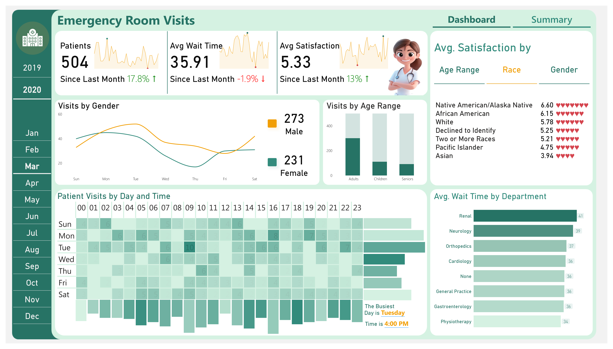

# Emergency Room Dashboard  

  

An interactive Power BI dashboard analyzing emergency room data to provide actionable insights for healthcare professionals.  

## Features  
- **Patient Satisfaction Metrics**: Tracks satisfaction scores and highlights improvements.  
- **Visit Trends**: Analyzes busiest days, demographic data, and visit growth.  
- **Interactive Design**: Slicers, drill-through pages, and tooltips for enhanced usability.  

## Results  
- Increased patient satisfaction by **13%**.  
- Reduced average wait times by **1.9%**.  

## Technical Highlights  
- **Power BI Tools**: Developed advanced DAX measures and optimized performance using **DAX Studio**.  
- **Data Insights**: Extracted key insights using DAX formulas for metrics like `AvgSatisfactionScore`, `VisitGrowth`, and `BusiestDay`.  

## Inspiration  
This project was inspired by the [Abdelytics tutorial](https://www.youtube.com/watch?v=...) and design ideas from [Wecare Medical Admin Dashboard on Dribbble](https://dribbble.com/shots/21217373-Medical-Admin-Dashboard-Wecare).  

## Color Palette  
The dashboard uses a custom color palette: [View Palette](https://color.adobe.com/Emergency-Room-Visits-Dashboard-color-theme-ca3024bf-ff70-46b1-8353-fcc4417f3dd2/).  

## Quick Start  
1. Download the `.pbix` file from the `src/` folder.  
2. Open it in **Power BI Desktop**.  
3. Connect to the `Hospital-ER.csv` file if prompted for data sources.  

## Repository Structure  
- `src/`: Contains the raw Power BI dashboard file (`.pbix`) and the raw data file (`.csv`).  
- `docs/`: Includes the project documentation (`.pdf`) and README.  
- `images/`: Contains screenshots or previews of the dashboard.  

## Contributing  
Feel free to fork the repository and suggest improvements or new features!  

## License  
This repository is under the MIT License.  
